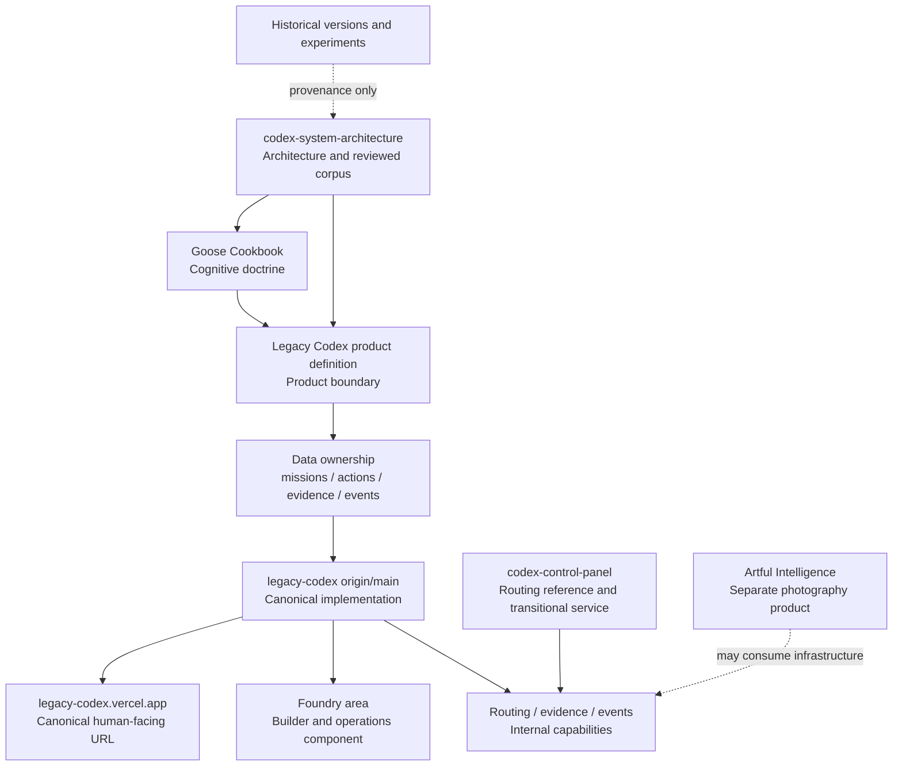

# Legacy Codex Canonical Source Graph

**Status:** Canonical navigation map
**Last verified:** 2026-08-31

This graph tells a fresh human or AI which source answers which question. A newer implementation does not silently supersede doctrine, and an old version label does not outrank current evidence.

## Authority by question

| Question | Canonical source | Does not establish |
| --- | --- | --- |
| What is the deep cognitive doctrine? | `codex-system-architecture/notion-wiki/docs/GOOSE-COOKBOOK.md` | Current deployment state |
| What is Legacy Codex and what is Foundry? | `docs/architecture/legacy-codex-product-definition.md` | A feature is implemented or live |
| Which store owns which truth? | `docs/architecture/data-ownership.md` | That every migration is applied in production |
| What code is current? | `edwardemoryphotography/legacy-codex` `origin/main` | That the commit is deployed |
| What is the canonical user URL? | `https://legacy-codex.vercel.app` | Runtime health without direct verification |
| What is currently merged, deployed, or blocked? | `PROJECT_STATUS.md`, rechecked against GitHub, Vercel, and runtime | Future state |

## Surface classification

| Surface | Classification | Current decision |
| --- | --- | --- |
| Root Legacy Codex app | **CANONICAL** | Human-facing product and default entry point |
| Foundry Console source under this repo | **INTERNAL COMPONENT** | Builder/operator boundary; do not expose its machinery by default |
| Routing, evidence, events, control plane | **INTERNAL COMPONENT** | Capabilities owned by the canonical system |
| `codex-control-panel` | **MIGRATE INTO CANONICAL** | Human-facing next-move routing is now in Mission; guarded persistence remains a transitional Foundry service until its server boundary is moved |
| `codex-system-architecture` | **ARCHITECTURE / GOVERNANCE** | Reviewed corpus and system explanation, not the runtime product |
| PocketForge | **SEPARATE SUPPORTING MODULE** | Native app-building surface; it may hand work to Foundry but does not define the Legacy Codex front door |
| `artful-intelligence-hub` | **SEPARATE SUPPORTING SURFACE** | Flock operations, not a Legacy Codex front door |
| Artful Intelligence | **SEPARATE — ON PURPOSE** | Photography product with its own user and primary job |
| Historical version dashboards and prototypes | **EXPERIMENT / HISTORICAL** | Provenance only; they do not define current product state |

## Supersession rules

1. The product is called **Legacy Codex**. UI labels such as v24, v27, v35.3, and v38 are historical strata.
2. `legacy-codex.vercel.app` is the only URL presented as the normal product entry point.
3. The deleted in-app Consolidation checklist is superseded by this source graph and `PROJECT_STATUS.md`; repository cleanup is not a user workflow.
4. A code merge may update implementation truth but cannot claim `Deployed`, `Runtime Verified`, or `Live` without those separate checks.
5. When sources conflict, record the contradiction and resolve it in the source that owns that question. Do not create a new cross-cutting master document.
