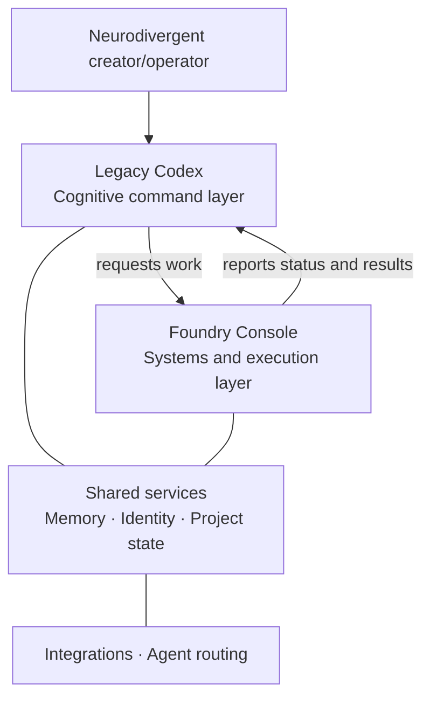

# Legacy Codex Product Definition & Differentiation

**Version:** 0.1  
**Date:** July 2026  
**Status:** Canonical  
**Decision owner:** Edward Emory Frye

## Decision

Legacy Codex and Foundry Console are distinct products with a shared architecture. They may exchange requests and status, but they must not duplicate one another's primary interface, user, or responsibility.

## 1. Category

### Legacy Codex

Legacy Codex is a **personal cognitive operating system**.

It is the user-facing cognitive command layer that protects context, identifies what matters now, and helps an individual move toward the next meaningful action.

### Foundry Console

Foundry Console is the **builder and operations environment** for creating, running, deploying, inspecting, and maintaining tools, agents, integrations, and modules.

It is the technical systems and execution layer.

## 2. Primary users

| Product | Primary user |
| --- | --- |
| Legacy Codex | The individual neurodivergent creator/operator |
| Foundry Console | The builder/operator managing systems, integrations, deployments, and agent infrastructure |

A person may use both products, but each product must remain optimized for its assigned role.

## 3. Core jobs

### Legacy Codex answers

- What matters right now?
- What should I do next?
- What context must not be lost?

### Foundry Console answers

- What systems exist?
- What is running?
- What is broken?
- What should be deployed or changed?

## 4. Shared boundary

- Legacy Codex may request work from Foundry Console.
- Foundry Console may report execution status, failures, and results back to Legacy Codex.
- Legacy Codex must not become a deployment console or infrastructure dashboard.
- Foundry Console must not become the individual's cognitive prioritization interface.
- A shared service is not automatically a shared interface.

## 5. Surrounding modules and surfaces

These capabilities belong within the canonical architecture. They are not separate, competing product definitions.

| Module or surface | Assigned role |
| --- | --- |
| Cognition | Visualization and interpretation layer |
| PocketForge | Mobile creation and execution surface |
| Semantic Starfield | Spatial memory and relationship visualization layer |
| Cognitive Profile | Personalization and adaptive behavior layer |

A module may be presented through Legacy Codex, Foundry Console, or both when appropriate, but its product ownership must follow the core jobs and boundary above.

## 6. Canonical architecture

### Layer responsibilities

1. **Legacy Codex — cognitive command layer**
   - Maintains personal and project context.
   - Prioritizes attention and next actions.
   - Presents relevant cognitive and project state.
   - Requests execution without exposing unnecessary operational complexity.

2. **Foundry Console — technical systems and execution layer**
   - Creates, configures, runs, deploys, and maintains agents and modules.
   - Exposes system health, failures, logs, integrations, and deployment state.
   - Reports useful outcomes to Legacy Codex.

3. **Shared services**
   - Memory
   - Identity
   - Project state
   - Integrations
   - Agent routing

Shared services must have clear contracts and must not force the two products to share the same interface.

## 7. Repository and screen audit taxonomy

Every existing repository, application, screen, module, and experiment must receive exactly one primary classification.

| Classification | Meaning |
| --- | --- |
| **Core** | Required to deliver the primary job of Legacy Codex or Foundry Console |
| **Module** | A bounded capability or surface that supports a core product |
| **Infrastructure** | Shared technical service, integration, deployment, or routing layer |
| **Experiment** | Active exploratory work that has not earned a canonical role |
| **Archive** | Preserved work that no longer supports the canonical architecture |

## 8. Audit rules

For every artifact:

1. Identify its current user and core job.
2. Assign it to Legacy Codex, Foundry Console, shared infrastructure, or neither.
3. Classify it as Core, Module, Infrastructure, Experiment, or Archive.
4. Keep features aligned with the assigned product role.
5. Move duplicated or misplaced features to the correct owner.
6. Archive experiments that do not support the canonical architecture.
7. Record unresolved ownership conflicts before implementation continues.

No artifact should remain canonical merely because it already exists.

## 9. Product decision test

Before adding or retaining a feature, answer:

1. Which primary user does it serve?
2. Which core question does it answer?
3. Which product owns the interface?
4. Does it duplicate another product's responsibility?
5. Is it Core, Module, Infrastructure, Experiment, or Archive?

If these questions cannot be answered clearly, the feature remains an **Experiment** until a decision is made.

## 10. Consequences

### We will

- Design Legacy Codex around cognitive continuity, prioritization, and next action.
- Design Foundry Console around construction, execution, observability, and maintenance.
- Treat Cognition, PocketForge, Semantic Starfield, and Cognitive Profile as modules or surfaces.
- Use shared services through explicit boundaries.
- Audit the existing codebase against this decision before consolidating interfaces.

### We will not

- Merge Legacy Codex and Foundry Console into one undifferentiated dashboard.
- Promote every prototype into a standalone product.
- Duplicate system-management controls inside the cognitive command experience.
- Duplicate cognitive prioritization inside the technical operations experience.
- Treat repository history as proof that a feature remains canonical.

## 11. Change control

This document is the canonical product-definition decision beginning with version 0.1.

Future changes must:

1. Increment the version.
2. Record the date and reason.
3. Identify which product boundary changed.
4. Include migration consequences for affected screens, modules, and repositories.
5. Be reviewed before implementation changes the architecture.
